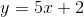
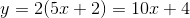
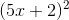
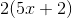

# Deep Learning with PyTorch 
> Belajar Deep Learning Secara Praktis Menggunakan PyTorch

## Pemasangan dan Penggunaan
- Anaconda silahkan lihat di repo Saya [Data Science with Python](https://github.com/rubiagatra/data-science-with-python)
- PyTorch silahkan unduh pada halaman utama [PyTorch](http://pytorch.org)

## Prasyarat

Selama kamu mengetahui apa yand ada di bawah ini, silahkan melanjutkan.

- Aljabar Dasar:
    -  
    - 
- Turunan Dasar:
    - Turunan dari  
    - 
- Dasar Python
    - List, Dictionaries, dan Tuples
    - Loops
    - Classes dan Functions

## Lisensi

Didistribusikan menggunakan lisensi MIT. Silahkan melihat `` LICENSE `` untuk lebih lanjut

## Kontribusi
1. Silahkan di Fork  
2. Buat branch baru (`git checkout -b feature/fooBar`)
3. Silahkan isi nama anda beserta tautan github anda di CONTRIBUTORS.md
4. Commit perubahan yang ada(`git commit -am 'Add some fooBar'`)
5. Push pada branch yang sudah ada (`git push origin feature/fooBar`)
6. Buat sebuah Pull Request baru
